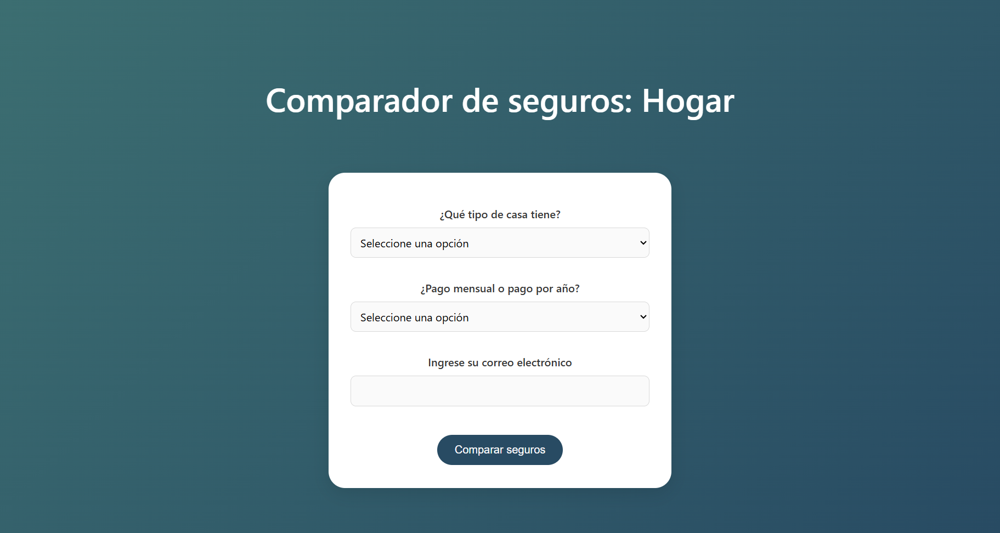
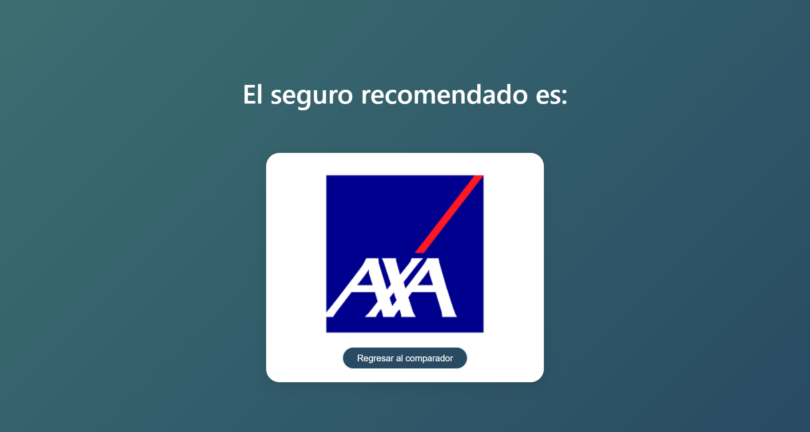

# Javier-Finance_JS-desde-cero-UDEMY

## Descripción
> Este repositorio reúne dos proyectos desarrollados en JavaScript, enfocados en demostrar el uso de la lógica, la interacción con el usuario y la manipulación del DOM para crear experiencias dinámicas en la web.
> 
> la idea original del proyecto pertenece al curso gratuito / video tutorial de Javier Finance en la plataforma UDEMY  
>
> Proyectos incluidos:  
>
> 1. **Comparador de Seguros**  
>    Aplicación que permite al usuario simular la selección de un seguro ficticio.  
>    Mediante la elección de distintos parámetros (como tipo de vivienda y monto de pago), el sistema muestra un ejemplo orientativo del tipo de seguro que podría adquirir.  
>
> 2. **Ruleta**  
>    Juego interactivo que genera números aleatorios entre 0 y 30.  
>    - Si el número es **par**, se muestra en **rojo**.  
>    - Si el número es **impar**, se muestra en **negro**.  
>    - Si el número es **0**, se presenta un resultado especial.  
>    El usuario introduce un número como apuesta y el sistema evalúa si coincide con el número generado.  
 

## Estado de carpeta 📊️

 

## Tecnologías utilizadas 🔨

 

### Notas importantes ⚠
  - Los documentos cuentan con comentarios, observaciones y fórmulas en español.
 

## Instalación y uso
No hay un proceso de instalación tradicional. Simplemente descarga el repositorio a tu computadora. Puedes hacerlo de dos maneras:

1. Clonar el repositorio usando Git:
`git clone https://github.com/odrasanchezdev/javascript-essentials`

2. Descargar un archivo ZIP directamente desde la página del repositorio en GitHub.

* _No requiere instalación de librerías adicionales._
* _Solo asegúrate de tener un navegador web actualizado (Chrome, Firefox, Edge o similar)._

Para ejecutar cada proyecto:
1. Abre el archivo ruleta.html o comparador.html en tu navegador.
2. Ingresa los datos solicitados-
3. Presiona el botón.

### Sistema de "Ruleta":
1. Generará un número aleatorio entre 0 y 30.
2. Mostrará si es rojo/par, negro/impar o el caso especial 0.
3. Indicará si tu número apostado coincide con el número generado.

### Sistema de "Comparador":
 1. Verifica que el usuario haya seleccionado el tipo de casa, el tipo de pago y proporcionado un correo electrónico válido.  
 2. Comprueba el formato básico del correo para asegurar que contenga los símbolos necesarios.  
 3. Según las opciones elegidas por el usuario, redirecciona a una página de ejemplo de seguro que muestra una propuesta ficticia adaptada a su selección.  

### Capturas de pantalla 📷
<table>
  <tr>
    <td></td>
  </tr>
  <tr>
    <td></td>
    <td></td>
  </tr>
</table>
 

## Soporte
Si tienes alguna pregunta, encuentras un error en alguno de los documentos o deseas sugerir una mejora, ¡no dudes en abrir un issue en este repositorio! Nos encantaría recibir tus comentarios.

* ¿Encontraste un error? Abre un issue y describe el problema.
* ¿Tienes una sugerencia? Abre un issue y comparte tu idea.

Acercate a mis redes sociales para atender tus dudas y sugerencias en la sección de [Contacto](#contacto-)
 

## Licencia ✅
Se permite el uso, copia y distribución de este proyecto, siempre y cuando se mantenga la atribución original y no se sublicencie. No se permite su distribución, modificación o uso comercial sin permiso expreso del autor.

Copyright (c) 2025 at Odra Sanchez. Enlace del perfil:

  

 

## Contacto 🌐
Si tienes alguna pregunta o sugerencia, no dudes en contactarme:

  
 
 
 
 
 
 

